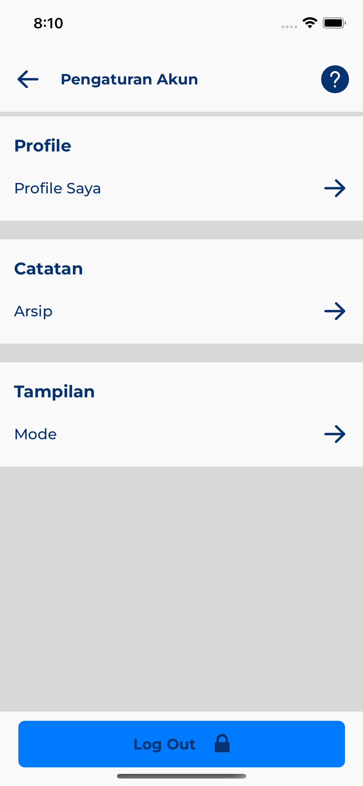
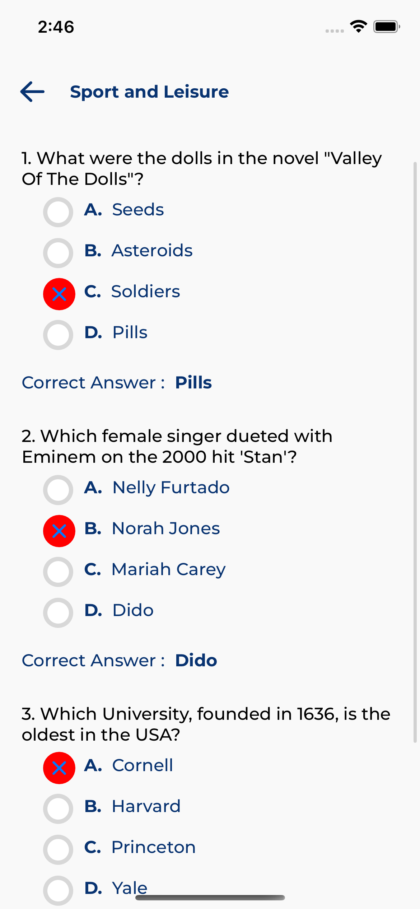
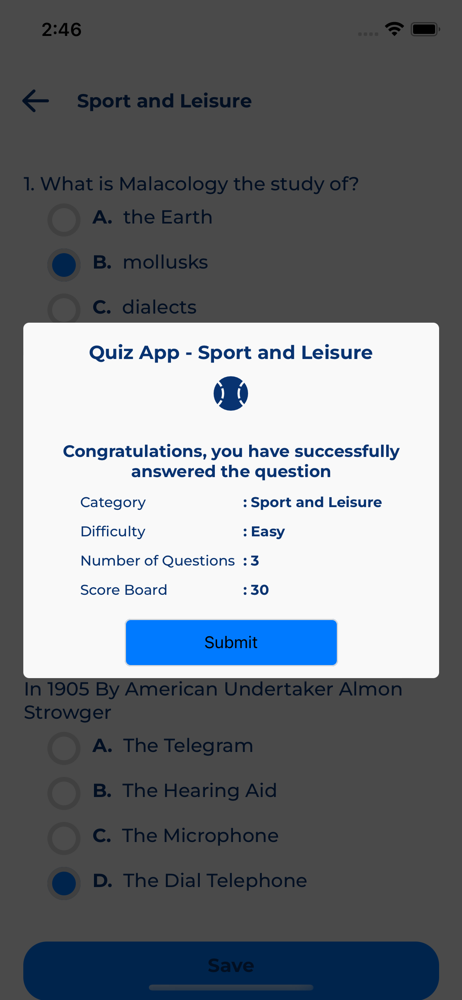
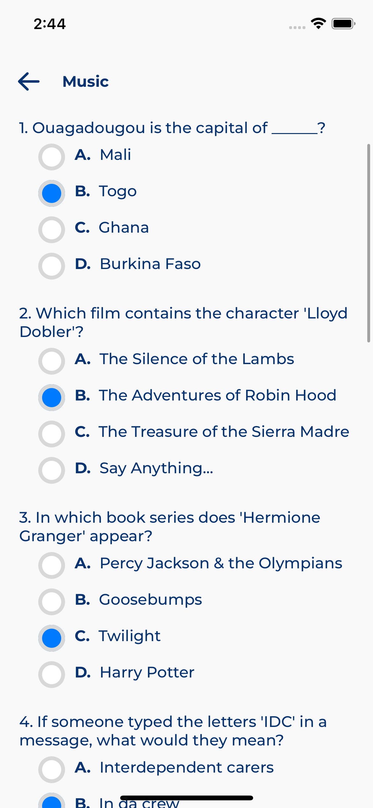
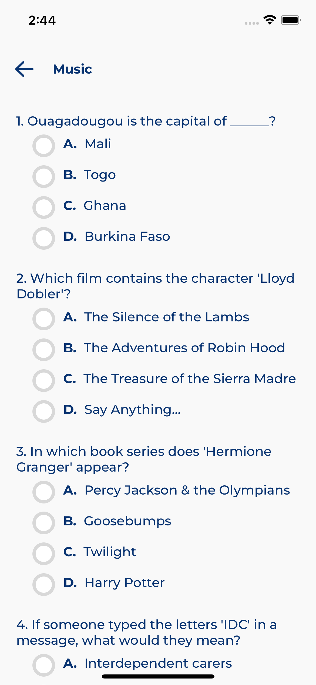
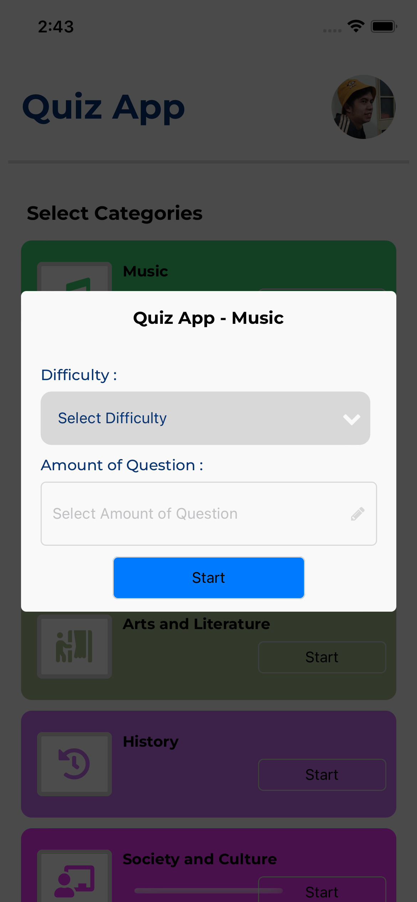
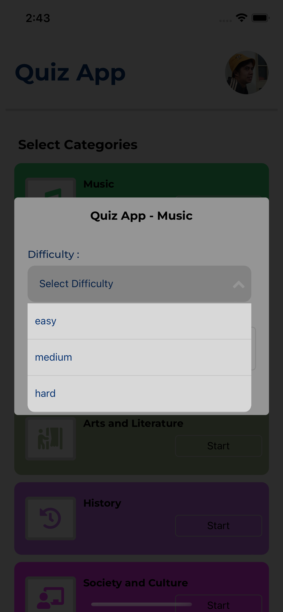
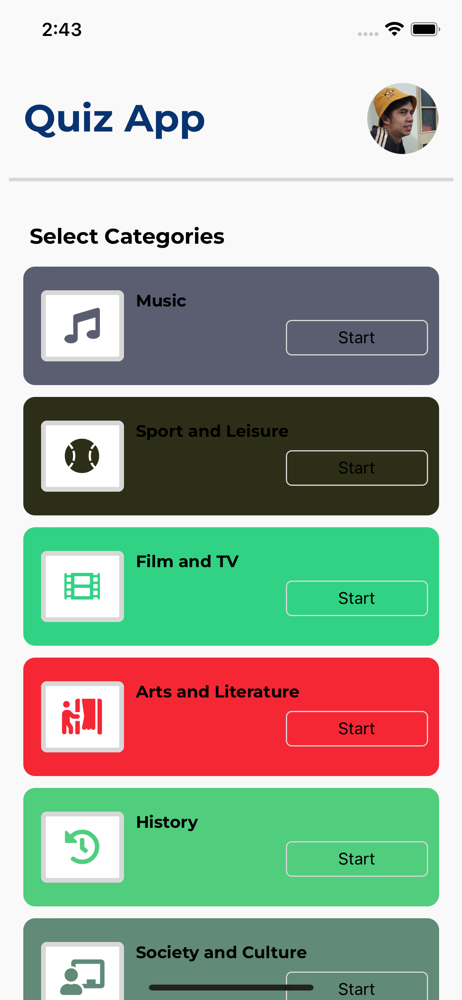

# react-native-quizapp
Quiz App with React Native

An Android application that contains several categories that allow users to answer questions according to the category chosen and the level of difficulty provided and answers will be distributed when scores and all questions are answered

- Features: Select Category, Login, Select Type of question (easy, medium, hard), Select number of questions 
- Programming Language: Typescript
- Framework : React Native
- Markup Languages: HTML, CSS
- API

### Screenshoot

    

    

    

    

